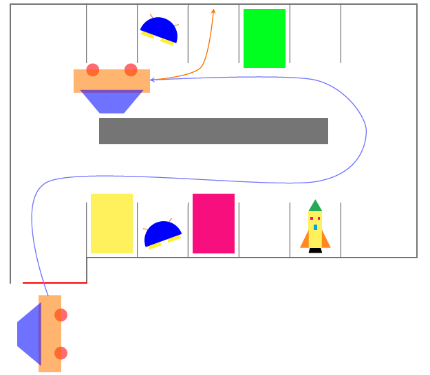

# Spacecraft-parking-lot-management-system

The goal of this project is to better understand Object Oriented Programming. In particular

Classes, Inheritance, and Polymorphism are at the core of the project and must be applied in

order to complete it. 

###  Project setup

**Parking area:** more than one floor, each one being of different size

**Vehicle types:**

• Teleported: have reserved slots marked by a rectangle randomly changing color;

• UFO: device that spins on itself;

• Spacecraft: vehicle which continuously zooms in and out;

• Car: regular car;

**Price:** depends on the type of vehicle and time spent

**Arrival ticket:** when a user arrives he receives a ticket containing:

• Time of arrival

• Type of the vehicle

• Some information (hint) on where to find an empty slot

**Departure ticket:** when a user leaves he receives a ticket containing:

• Time spent in the parking lot

• Type of vehicle

• Price

**Vehicle’s motion:**

• When the barrier opens, move from the entrance to a free slot;

• Follow a smooth trajectory;

• Stop after an empty space and reverse into the slot following a smooth curve;

 **Milestone 1**

Tasks to be completed:

• Write a precise interface for all the classes from the regular parking lot;

• Implement a function which finds an empty slot;

• Implement a function which calculates the price to be paid on exiting the parking lot;

• Implements two function to print a ticket for entering and exiting vehicles;

**Milestone 2**

Tasks to be completed:

• Reorganise milestone 1 into proper classes using inheritance and polymorphism;

• Complete the demonstration mode for the regular parking lot;

• Draw a clear and precise hierarchy diagram for the interstellar parking lot; In particular define all

the classes (with their attributes and methods) and use inheritance and polymorphism;

**Final submission**

Tasks to be completed:

• Following the hierarchy diagram from milestone 2, implement all the classes for the interstellar

parking lot;

• Write a simple interface allowing the user to specify the number of slots in the parking and allowing

a vehicle to enter and park in an empty slot;organise their project they come up with the following ideas.

